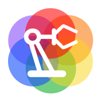

# Software Engineer and ~~Addict~~ Enthusiast

### Welcome to my little neck of the woods, it's nice to meet you!

Whether it's professional or personal, I am passionate about software development and engineering.
I love exploring the physical and digital worlds, and bringing the imagination to life through code.
While most of my time is spent on closed source projects, I have a great appreciation for open source software
and the ideas they share with the world.

## What I Code With

Languages, frameworks, and software that I love working with, both personally and professionally.
Not mutually exclusive, I also enjoy learning new languages and frameworks, as they each have their own merits.

 

## Top Software

Favorite day-to-day software I use make other software, collaborate, and simplify/automate tasks in general. Always keep
an extensive toolbox handy.

 

## Other ~~Addictions~~ Projects

Development and engineering can be a real addiction, as I also enjoy Game development, IoT/Home Automation,
building custom PCs, and building Death Stars (3D modeling/printing).

 

## My Guidelines/Clichés (mostly for development, but also life in general)

- **Always ask "What could go wrong?"**

  Take a close look at everything you do, and try to understand the impact it may have on others.
  Don't make someone else clean up your mess.

- **Sometimes it's okay to be a "Cowboy"**

  When people are telling you "no", ask yourself: are they doing it selfishly, or are they truly thinking about others?
  At the end of the day, you answer to yourself, so if you are thinking about others, and it feels right, just do it.

- **Take pride in everything**

  If you don't enjoy or take pride in what you are doing, you probably shouldn't do it. Do something else.
  Life is short.

- **Live like there is no tomorrow**

  Assume today is always your last, and everything you do should be able to be picked up where you left off.
  Leave the world in a better place than when you found it.
